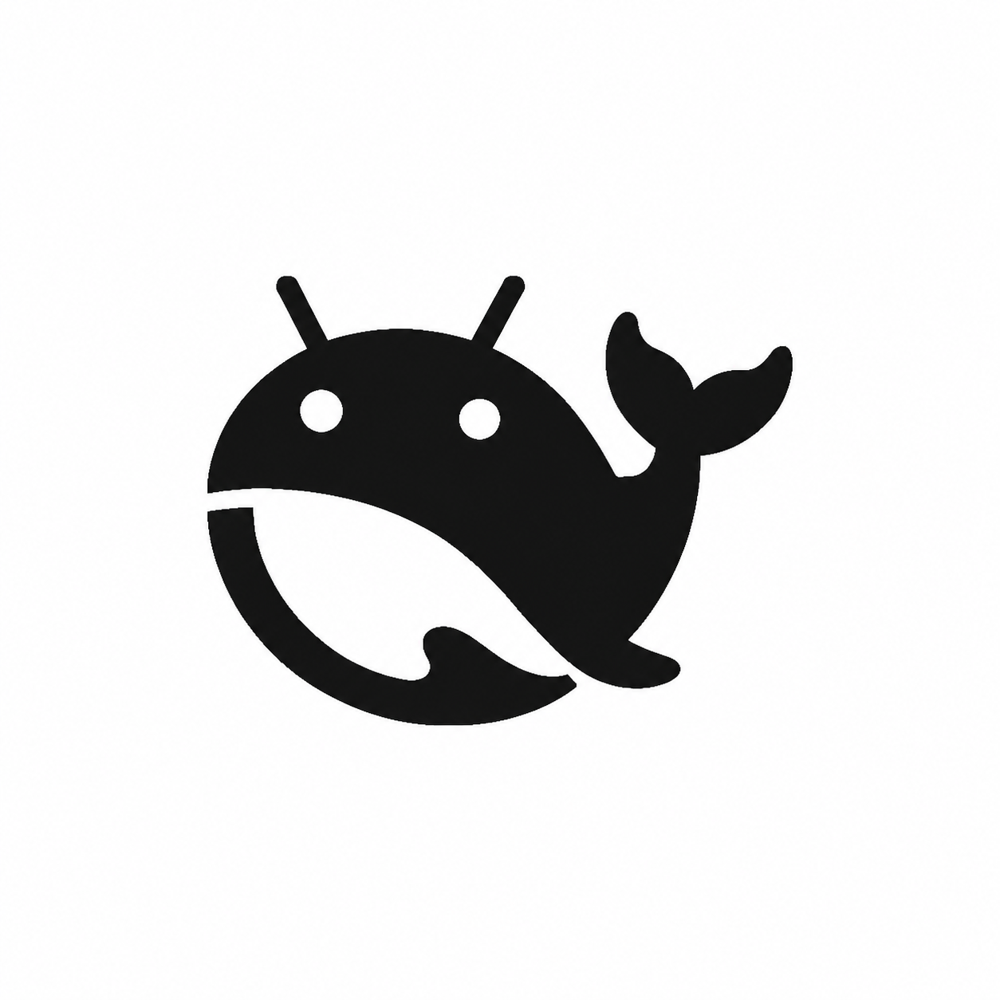
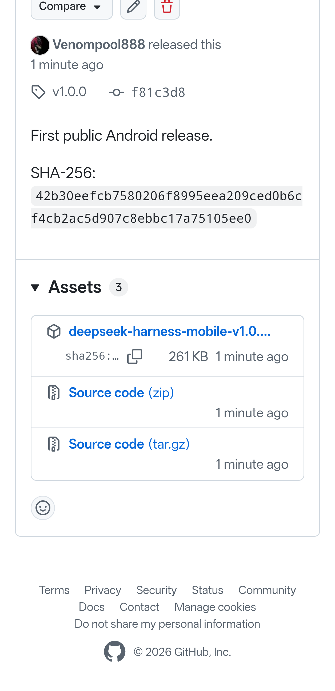
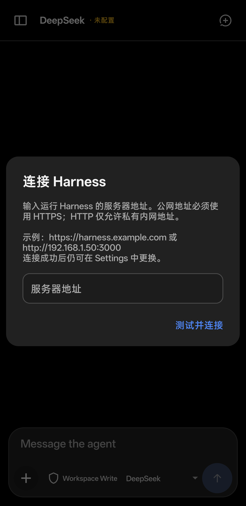
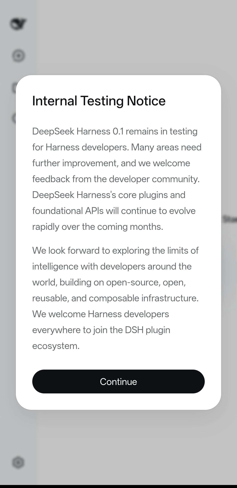
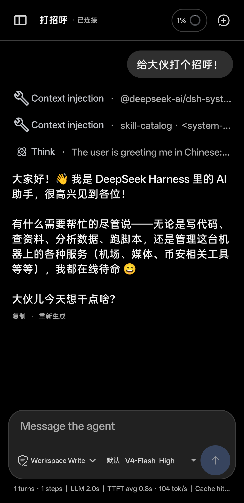
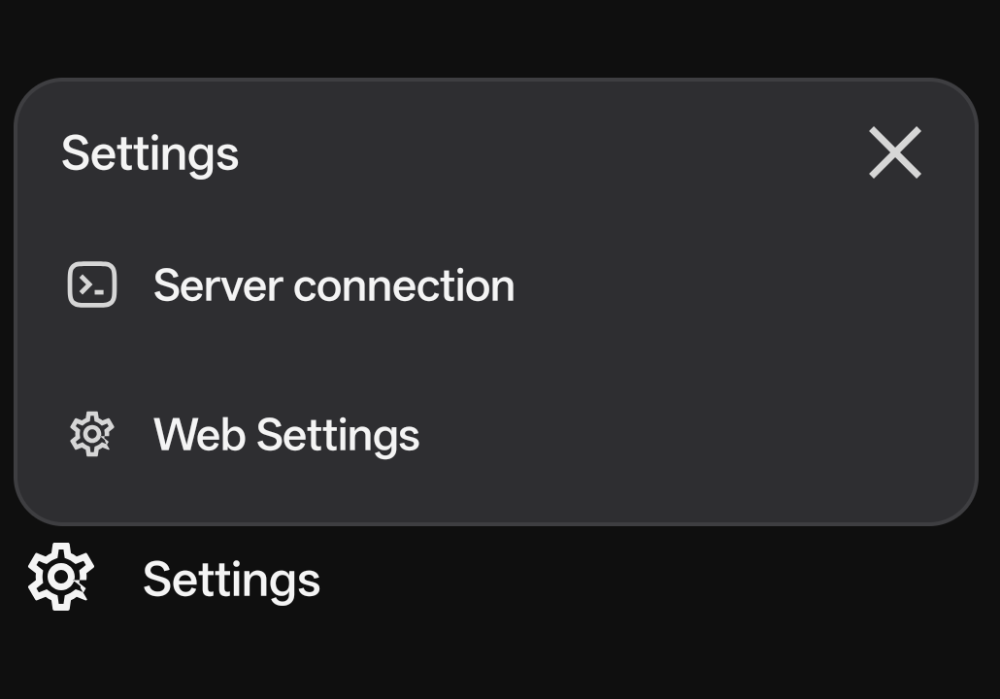

  

<h1 align="center">DeepSeek Harness Mobile</h1>

  一个连接自托管 DeepSeek Harness 的 Android 客户端。

  <a href="https://github.com/Venompool888/deepseek-harness-mobile/releases/latest"><strong>下载最新版 APK</strong></a>

## 安装

本流程已在 **OPPO CPH2797（Android 16 / ColorOS 16）** 上实际验证。

1. 在手机 Chrome 中打开 [Latest Release](https://github.com/Venompool888/deepseek-harness-mobile/releases/latest)。
2. 找到 **Assets**，点击 `deepseek-harness-mobile-v1.0.1.apk` 下载。
3. 下载完成后打开 APK，并按 ColorOS 的安装提示继续。如果系统阻止安装来自浏览器的应用，请按系统提示临时允许当前浏览器安装未知应用，然后返回继续安装。
4. 安装完成后打开 **DeepSeek Harness Mobile**。

  

> 当前 v1.0.1 APK 的 SHA-256：`69307f465bef93d0c359950f2b1e7f94a951177ea1c96f0845aaf49f3b667bf9`

## 首次连接

首次打开时，应用不会预置任何服务器地址：

1. 输入你自己的 Harness 服务器地址，例如 `https://harness.example.com`。
2. 点击 **测试并连接**。
3. 如果服务器启用了 Cloudflare Access，请在出现的登录页中完成服务器所有者配置的验证方式。
4. 如果 Harness 显示 **Internal Testing Notice**，点击 **Continue**。
5. 返回客户端后，顶部出现 **已连接** 即表示配置成功。

  
  &nbsp;
  

  

实测中，强制停止并重新打开应用后，服务器配置、登录状态和当前会话均能保留。

## 更换服务器

打开左侧边栏，点击底部设置菜单中的 **服务器连接**，即可测试并切换到其他内网 IP 或域名。

  

## 连接要求

- Android 8.0（API 26）或更高版本。
- 手机必须能够访问你的 Harness 服务器。
- 公网服务建议并默认要求使用 HTTPS。
- HTTP 仅适用于局域网 IP、`localhost` 或 `.local` 地址。

服务器地址与登录 Cookie 只保存在设备本地。本仓库及发布 APK **不包含维护者的服务器域名、账号、密钥或访问凭据**。
